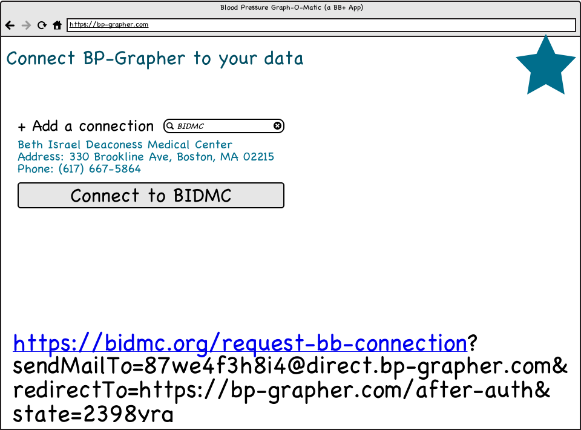
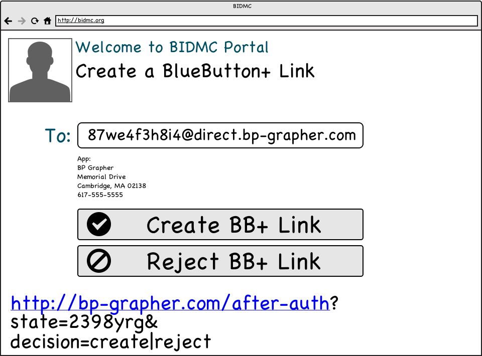
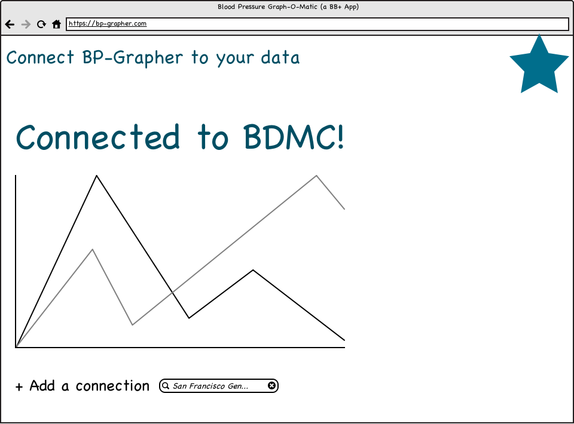

# This work has been supplanted!
# [https://github.com/blue-button/blue-button-plus-pull](https://github.com/blue-button/blue-button-plus-pull)

---

# BlueButton+ Push: Simplifying Patient Workflows

## Background: Today's Workflow

It's been exciting to see the BlueButton+ Push implementation guide come
together, and gratifying to see trust bundles being used to bootstrap circles
of trust within the BlueButton+ Direct community.  Now that so much
infrastructure is in place, it's time to think carefully about the
**patient-facing workflows** that we'll need in order to connect apps to data
**simply and safely**.

### Example:  Getting BP readings to a "BP Grapher" app
So what happens when a patient discovers a new app ("BP Grapher") and would like
to connect it to her health data via BlueButton+ Push?  It's a pretty good guess
that the process will look something like this:

* Patient visits https://bp-grapher.com and registers for an account.
* BP Grapher presents the patient with a screen something like:

In other words: to connect the app, the patient needs to know the portal URL 
for each of her data providers; she needs to log in, locate the BB Connection
feature (which will differ from portal to portal), and type or copy/paste
the appropriate (app-specific) Direct address in the authorization form.

This process requires **many steps**, is **error prone**, and in the end provides
**no explicit notification** to the app that a connection has been established. 

It's a start -- but we can do better!

## Proposal: Simpler Redirection-Based Workflow
We can streamline this process to make it more consistent and easier for
patients.  The following is a **strawman proposal** for how a streamlined system
might work -- it's designed to **provoke comments and feedback**!  (Also, please
note that BIDMC and SFGH are used purely for illustrative purposes in this
mockup scenario.)

### Step 1: Choose a Provider

If BP Grapher can learn about which data holders support BlueButton+ Push,
it can present the patient with a simple "find my provider" search box. 
(How this happens is out of scope for this proposal -- but centralized
infrastructure could be helpful, perhaps taking advantage of the existing
BlueButton+ Trust Bundle distribution mechanism.)

When a patient identifies a provider to connect with, she just clicks 
"Connect to [Provider]".  Behind the scenes, she's redirected to a special
URL within the provider's portal.  She sees...

### Step 2: Create a BB+ Connection

In this example, the patient is redirected to an authorization screen within
her provider's portal.  (Note: she's probably presented with a login screen
first; after she logs in, she sees the screen above.)  

Very simply, the provider shows the patient a pre-filled authorization form.
The patient sees the proposed Direct e-mail endpoint address, as well as basic
information about the app itself. (Where this app-specific information
comes from is out of scope -- but again, the Trust Bundle infrastructure could
be a good starting point.) 

She chooses `Create` or `Reject`, and is redirected back to the BP Grapher app,
which learns about her decision.  

### Step 3: Done!  (Or connect to more providers as needed.)

At this point, the patient is back at BP Grapher's site.  She can begin to see
her blood pressure data as soon as the provider sends it over to the app.  And
she can connect to additional providers as needed.

## Technical Details: How It Works
To support this redirection-based workflow, **each BlueButton+ data holder needs
to expose a single HTTP endpoint at a published URL.**

For this example, we'll call that URL `/create-bb-connection`.  

#### The endpoint takes three parameters:

 * `sendMailTo`: Direct address to which a connection is being requested
 * `redirectTo`: HTTPS URL to return the patient to after a connection is created/rejected
 * `state`:  (optional) app-supplied string that will be returned to the app along with the patient's decision

#### The job of this endpoint is to:

1.  Ensure the patient is logged in
2.  Present the patient with a pre-filled authorization form asking to create a connection to the address found in `sendMailTo`
3.  Present the patient with any addtional information that could help in making an informed authorization decision
4.  Record the patient's `create` vs. `reject` decision, establishing a persisting BlueButton+ connection in the event of `create`.
5.  Redirect the patient back to the app via the HTTPS URL found in `redirectTo`, appending two parameters:

 * `state`: copy of the app-supplied state from the first step
 * `decision`: either `create` or `reject`, according to the patient's decision

